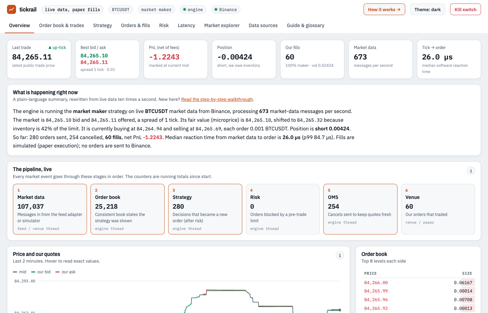

# tickrail

[](https://github.com/upendrx/tickrail/actions/workflows/ci.yml)
[](#license)

A low-latency trading engine in Rust, built the way electronic market makers
build theirs, with pluggable market data, pluggable strategies, deterministic
replay and a live web console.



```bash
cargo build --release
./target/release/tickrail run                          # built-in exchange simulator
./target/release/tickrail run -c config/binance.toml   # live public data, paper fills
open http://127.0.0.1:8080
```

## What's in the box

- **Engine.** One thread owns the book, strategy, risk and order state. Threads
  talk only through lock-free rings, and there's no allocation on the hot path.
  Prices are integer ticks. Market data to order takes a few hundred nanoseconds
  of software time.
- **Market data adapters**, picked in the config file:

  | Adapter | Market | Needs |
  |---|---|---|
  | `binance` | Binance / Binance.US spot | nothing (public data) |
  | `okx` | OKX spot | nothing |
  | `kraken` | Kraken spot | nothing |
  | `alpaca` | US equities | a free Alpaca account |
  | `csv` | any market, from a file | a CSV file |
  | `simulator` | built-in matching engine with synthetic traders | nothing, works offline |

  A new venue is one file implementing a small trait. See
  [writing an adapter](docs/src/adapters.md#writing-an-adapter).
- **Strategies:** an inventory-skewed market maker (Avellaneda-Stoikov style)
  and an order-book-imbalance taker. Add your own in Rust, or write one in
  Python and run it inside the same event loop.
- **Risk:** pre-trade limits on size, worst-case position, price band, order
  rate and loss, plus a kill switch. Cancels are never blocked.
- **Journal and replay.** Every event is recorded in a compact binary journal.
  `tickrail replay` re-runs a journal or CSV through any strategy at 10M+
  events per second, with identical results every time.
- **Web console.** Book, quotes, fills and markouts, risk usage, latency
  histograms, raw venue frames, and a walkthrough that explains every
  calculation with live numbers.
- **Python bindings.** The order book, journal reader and backtester, with
  results as columnar dicts ready for Polars or pandas.

## Configuration

One TOML file picks every component by name. Any value can be overridden
from the command line.

```toml
[feed]
adapter = "okx"
symbol = "BTC-USDT"

[execution]
venue = "paper"
taker_fee_bps = 2.0

[strategy]
name = "market_maker"
size = 0.001
max_inventory = 0.01
half_spread_ticks = 5

[risk]
max_order_size = 0.002
max_position = 0.02
price_band_ticks = 5000
max_loss = 100.0

[engine]
wait = "backoff"            # "spin" on a dedicated core
journal = "data/okx.journal"
```

```bash
tickrail run -c config/okx.toml --set feed.symbol=ETH-USDT --set engine.wait=spin
tickrail replay data/okx.journal -c config/okx.toml --set strategy.half_spread_ticks=8
tickrail list          # adapters and strategies in this build
```

The full reference is in [configuration](docs/src/configuration.md).

## Python

```bash
pip install ./bindings/python
```

```python
import tickrail

class JoinTheTouch:
    def on_book(self, ctx):
        if ctx.best_bid and not ctx.open_orders:
            ctx.buy(ctx.best_bid, 0.001)
            ctx.sell(ctx.best_ask, 0.001)

r = tickrail.backtest("data/okx.journal", JoinTheTouch(), max_order_size=0.002, max_position=0.01)
print(r["fills"], r["pnl"])
```

## Performance

Release build on an Apple M1 Pro. Linux numbers on tuned hardware are
welcome as pull requests.

| | |
|---|---|
| Lock-free ring, push + pop | 8.3 ns |
| L2 book update | 9.7 ns |
| Matching engine operation | 86 ns |
| Replay | 10 to 14 M events/s |
| Tick-to-order across threads (`wait = "spin"`) | p50 ≈ 0.3 to 0.5 µs |
| Memory | ~13 MB resident |

[Performance and tuning](docs/src/performance.md) covers wait strategies, core
pinning and Linux tuning.

## Runs on

Linux (x86_64, ARM64), macOS (Apple Silicon, Intel) and Windows, from a
Raspberry Pi to a colocated server. It needs one core and about 128 MB of RAM
at minimum. For low latency, use a Linux box with a few isolated cores. See
[installation and requirements](docs/src/installation.md). A `Dockerfile` is
included.

## Documentation

The [developer guide](docs/src/SUMMARY.md) covers installation, market
concepts, every component, writing adapters and strategies, performance
tuning, deployment and internals. Build it locally with `mdbook serve docs`.

## Status

tickrail does not send orders to exchanges yet: execution is paper fills on
live data, or the built-in simulator. Order gateways are next on the
[roadmap](docs/src/roadmap.md). Nothing here is investment advice, and paper
results are not evidence that a strategy makes money.

## Contributing

Adapters for new venues, strategies, performance work and docs are all
welcome. Start with [CONTRIBUTING.md](CONTRIBUTING.md).

## License

Licensed under either of [Apache License 2.0](LICENSE-APACHE) or
[MIT license](LICENSE-MIT), at your option.
